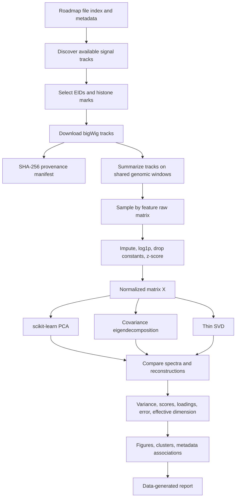

# Project Workflow

The end-to-end command is `python -m epigenomics_pca all`. Each intermediate
matrix and report is written to `data/` or `outputs/`; external tracks are not
included in version control.